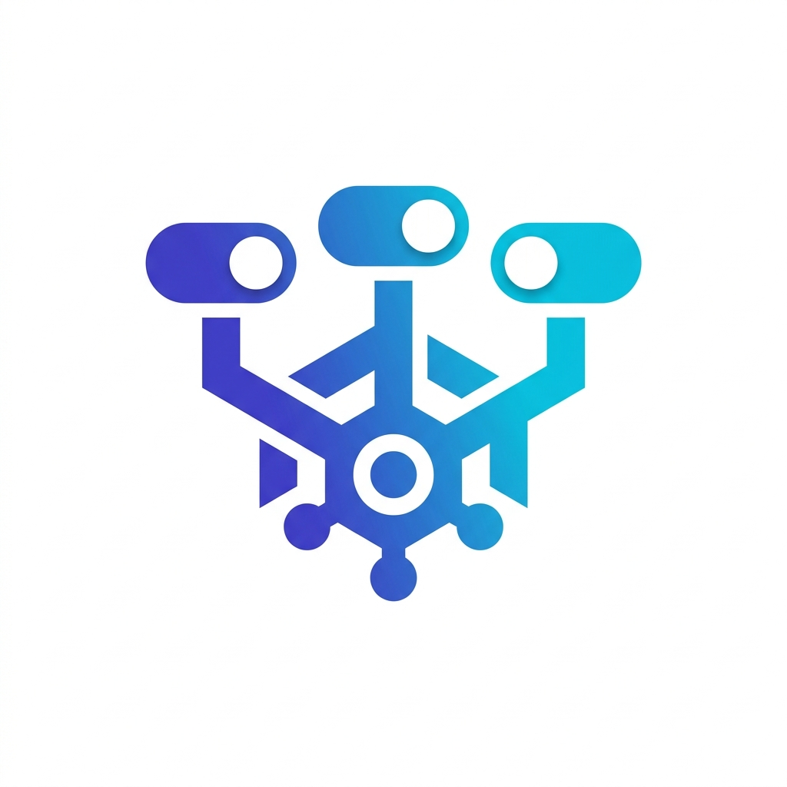

<div align="center">



# ConfigHub

### Open-source feature flags & remote configuration — built for teams who ship fast.

Take control of your releases with powerful feature flags, targeted rollouts, and instant configuration changes — no redeployment required.


---

**[Getting Started](#-getting-started)** · **[Features](#-features)** · **[SDKs](#-sdks)** · **[Architecture](#-architecture)** · **[Contributing](#-contributing)**

</div>

---

## ✨ Why ConfigHub?

Shipping code shouldn't mean crossing your fingers. ConfigHub gives you a clean, self-hosted platform to:

- **🔀 Decouple deploys from releases** — ship code behind flags and flip them on when you're ready
- **🎯 Target the right users** — roll out features to specific segments based on custom attributes
- **🌍 Manage multiple environments** — separate configs for dev, staging, and production
- **📊 Track every change** — full audit logs so you always know who changed what, and when
- **🔔 Stay in the loop** — webhooks notify your systems in real time when flags change

---

## 🖼 Features

<details>
<summary><strong>🏢 Organizations & Products</strong></summary>
<br/>

Built for multi-tenancy from the ground up. Create separate organizations for different teams or clients, and manage multiple products within each one.

Switch between them instantly from the header dropdowns.

Organization admins can now:
- add existing users directly by email
- create pending invites for teammates who have not signed up yet
- update member roles and remove members with last-admin protection

<p>
  
</p>
<p>
  
</p>
</details>

<details>
<summary><strong>🚩 Feature Flags & Configs</strong></summary>
<br/>

Create boolean feature flags or rich configuration values. Each config lives within a product and can be toggled independently per environment.

<p>
  
</p>
</details>

<details>
<summary><strong>🌐 Environments</strong></summary>
<br/>

Define environments like Development, Staging, and Production. Each environment maintains its own independent flag states, so your staging experiments never leak into production.

<p>
  
</p>
</details>

<details>
<summary><strong>🎯 Segments & Targeting</strong></summary>
<br/>

Build user segments based on custom rules and attributes. Target "Beta Users", "Enterprise Customers", or "US-based free-tier users" — whatever your rollout strategy needs.

<p>
  
</p>
</details>

<details>
<summary><strong>🏷️ Tags</strong></summary>
<br/>

Organize your configs with tags for easy filtering and grouping across large projects.

<p>
  
</p>
</details>

<details>
<summary><strong>🔑 SDK Keys</strong></summary>
<br/>

Generate unique SDK keys for each environment to securely connect your client applications.

<p>
  
</p>
</details>

<details>
<summary><strong>📋 Audit Logs</strong></summary>
<br/>

Every action is tracked. See a chronological feed of who changed what across your organization — invaluable for debugging and compliance.

<p>
  
</p>
</details>

<details>
<summary><strong>🛡️ Permission Groups</strong></summary>
<br/>

Define reusable permission groups for each product with a simple permission matrix covering flags, environments, segments, tags, SDK keys, webhooks, and audit visibility.
</details>

<details>
<summary><strong>🔔 Webhooks</strong></summary>
<br/>

Configure webhook endpoints to receive real-time notifications when flags or configs change. Great for triggering CI/CD pipelines, Slack alerts, or cache invalidations.

<p>
  
</p>
</details>

> 📖 **Full visual documentation** with more screenshots is available in [`docs/FEATURES.md`](docs/FEATURES.md).

---

## 🚀 Getting Started

### One command with Docker Compose (recommended)

```bash
docker compose up --build
```

That's it. Once containers are up:

| Service    | URL                                        |
|------------|--------------------------------------------|
| Dashboard  | [http://localhost:3000](http://localhost:3000) |
| Backend API | [http://localhost:8000](http://localhost:8000) |
| Health Check | [http://localhost:8000/api/v1/health](http://localhost:8000/api/v1/health) |

### Run locally (for development)

<details>
<summary><strong>Backend</strong></summary>

```bash
cd backend
python -m venv .venv
source .venv/bin/activate
pip install -e .
uvicorn app.main:app --reload
```

The backend defaults to **SQLite** for local dev — no database setup needed.

Available at `http://localhost:8000`.
</details>

<details>
<summary><strong>Frontend</strong></summary>

```bash
cd frontend
npm install
NEXT_PUBLIC_API_URL=http://localhost:8000 npm run dev
```

Available at `http://localhost:3000`.
</details>

To enable "Sign in with Google", set the same Google web client ID in both
`GOOGLE_CLIENT_ID` and `NEXT_PUBLIC_GOOGLE_CLIENT_ID` before starting the apps.

### Team onboarding

- Existing users: open an organization and add them from the **Organization Members** panel.
- New users: create a pending invite by email; the invite will be accepted automatically when they sign up later with that same email.

<details>
<summary><strong>SDKs</strong></summary>

**JavaScript / TypeScript:**
```bash
cd packages/sdk-js
npm install && npm run build
```

**Python:**
```bash
cd packages/sdk-python
python -m venv .venv && source .venv/bin/activate
pip install -e .[dev]
```
</details>

---

## 📦 SDKs

ConfigHub ships with first-party SDKs that handle fetching, caching, polling, and client-side evaluation of targeting rules.

### JavaScript / TypeScript

```typescript
import { ConfigHubClient } from "@confighub/sdk-js";

const client = await ConfigHubClient.create("YOUR_SDK_KEY", {
  baseUrl: "http://localhost:8000",
});

const showNewCheckout = client.getValue("new_checkout", false, {
  identifier: "user-123",
  country: "IN",
  plan: "pro",
});
```

### Python

```python
from confighub_sdk import ConfigHubClient

client = ConfigHubClient.create(
    "YOUR_SDK_KEY",
    base_url="http://localhost:8000",
)

show_new_checkout = client.get_value(
    "new_checkout",
    False,
    {"identifier": "user-123", "country": "IN", "plan": "pro"},
)
```

Both SDKs support:
- ⚡ On-demand config refresh
- 🔄 Automatic polling for changes
- 🧮 Client-side evaluation of targeting rules, segments & percentage rollouts

Example apps are included for both SDKs:
- JavaScript: [`examples/js-sdk-app`](examples/js-sdk-app)
- Python: [`examples/python-sdk-app`](examples/python-sdk-app)

---

## 🏗 Architecture

```
┌──────────────────────────────────────────────────────────┐
│                      ConfigHub                           │
│                                                          │
│  ┌─────────────┐    ┌──────────────┐    ┌────────────┐   │
│  │  Next.js 14 │───▶│  FastAPI     │───▶│ PostgreSQL │   │
│  │  Dashboard  │    │  Backend     │    │ / SQLite   │   │
│  └─────────────┘    └──────┬───────┘    └────────────┘   │
│                            │                             │
│                     ┌──────▼───────┐                     │
│                     │  Public SDK  │                     │
│                     │  Endpoint    │                     │
│                     └──────┬───────┘                     │
│                            │                             │
└────────────────────────────┼─────────────────────────────┘
                             │
              ┌──────────────┼──────────────┐
              │              │              │
        ┌─────▼─────┐  ┌─────▼─────┐ ┌──────▼─────┐
        │  JS/TS    │  │  Python   │ │  Your App  │
        │  SDK      │  │  SDK      │ │  (via API) │
        └───────────┘  └───────────┘ └────────────┘
```

| Layer | Tech |
|-------|------|
| **Frontend** | Next.js 14 · React 18 · TypeScript · Tailwind CSS |
| **Backend** | FastAPI · SQLAlchemy (async) · Pydantic |
| **Database** | PostgreSQL (production) · SQLite (local dev) |
| **SDKs** | TypeScript · Python |
| **Infrastructure** | Docker Compose |

---

## 📁 Repo Structure

```
config-hub/
├── backend/              # FastAPI API server
├── frontend/             # Next.js admin dashboard
├── packages/
│   ├── sdk-js/           # JavaScript/TypeScript SDK
│   └── sdk-python/       # Python SDK
├── docs/                 # Screenshots & feature documentation
├── docker-compose.yml    # Full-stack local setup
└── Makefile              # Lint & format shortcuts
```

---

## 🤝 Contributing

Contributions are welcome! Here's how to get started:

1. Fork the repo
2. Create your feature branch (`git checkout -b feature/amazing-feature`)
3. Commit your changes (`git commit -m 'Add amazing feature'`)
4. Push to the branch (`git push origin feature/amazing-feature`)
5. Open a Pull Request

### Code Quality

```bash
make lint      # Check for issues
make format    # Auto-format code
```

---

## 📄 License

This project is open source. See the repository for license details.

---

<div align="center">

**Built with ❤️ for developers who want control over their releases.**

</div>
