# Config-Hub Documentation

Welcome to the **Config-Hub** platform documentation! This guide showcases the core features provided by our feature flag and configuration management dashboard. 

Below you will find a visual walkthrough of the main capabilities, complete with screenshots of the actual interface.

> **Tip:** Navigating the platform is easy. You can switch between different organizations and products using the selectors in the top header, and use the left sidebar to dive into specific features.

---

## 1. Organizations and Products Management

Config-Hub is built for multi-tenancy. You can create multiple organizations to isolate users and billing, and within each organization, you can define multiple products.

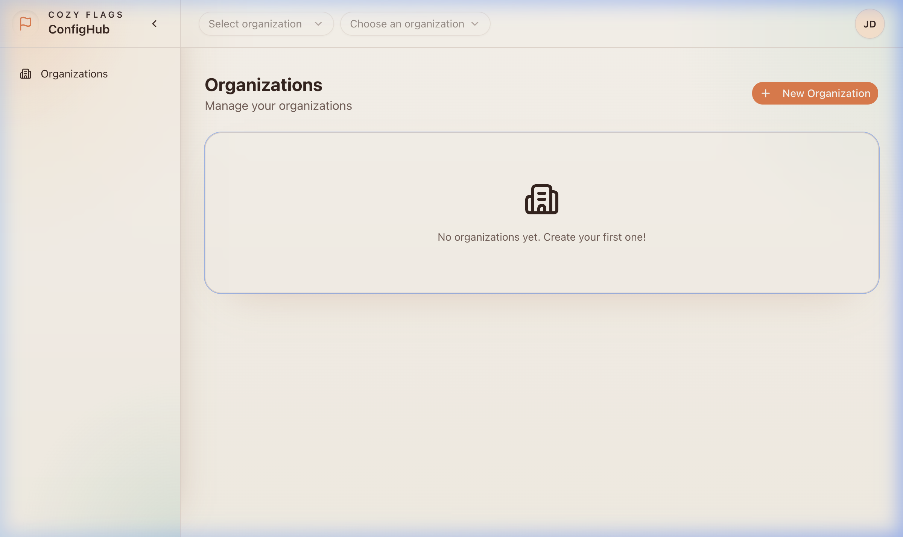
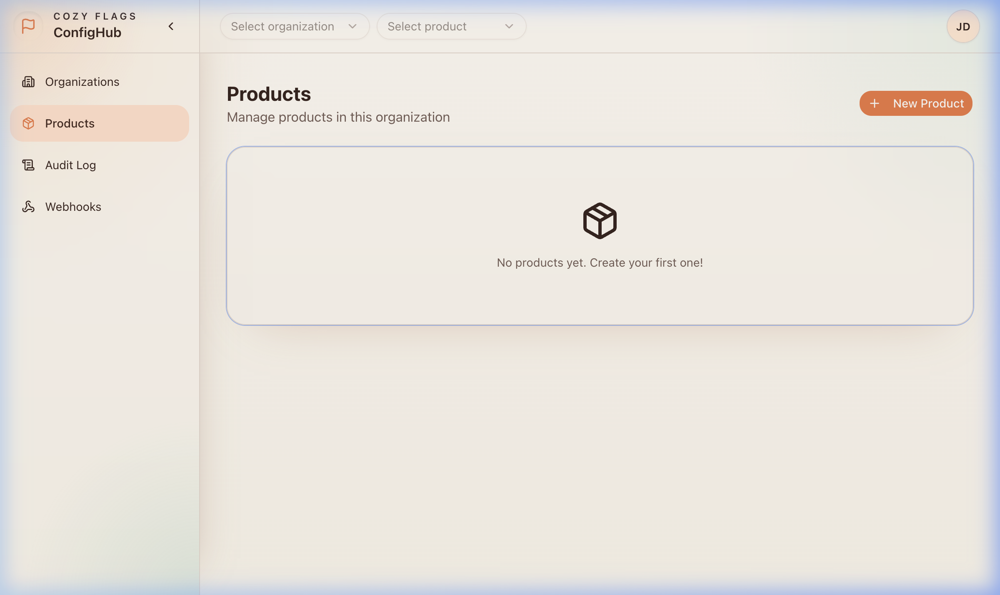
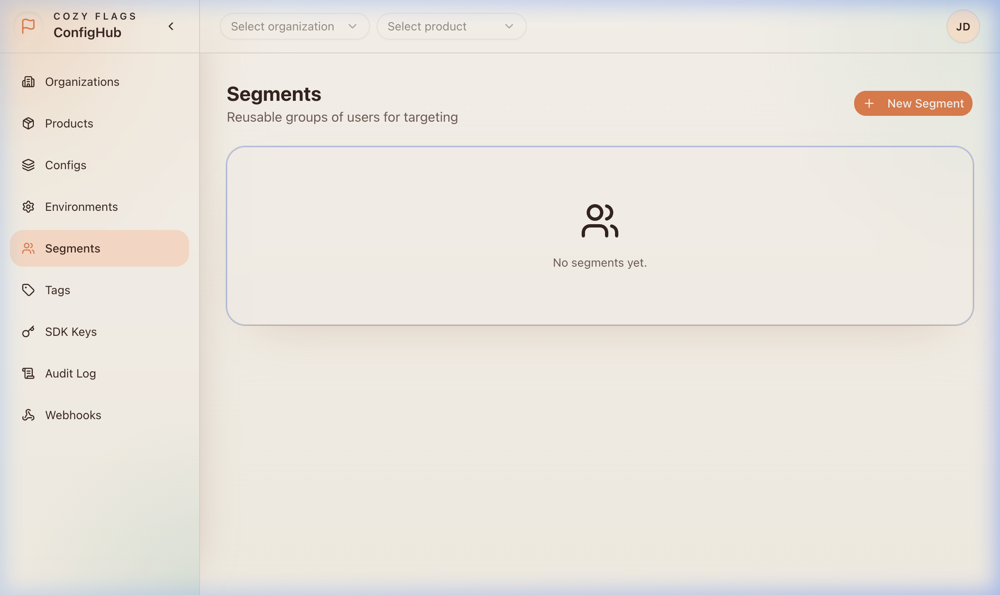
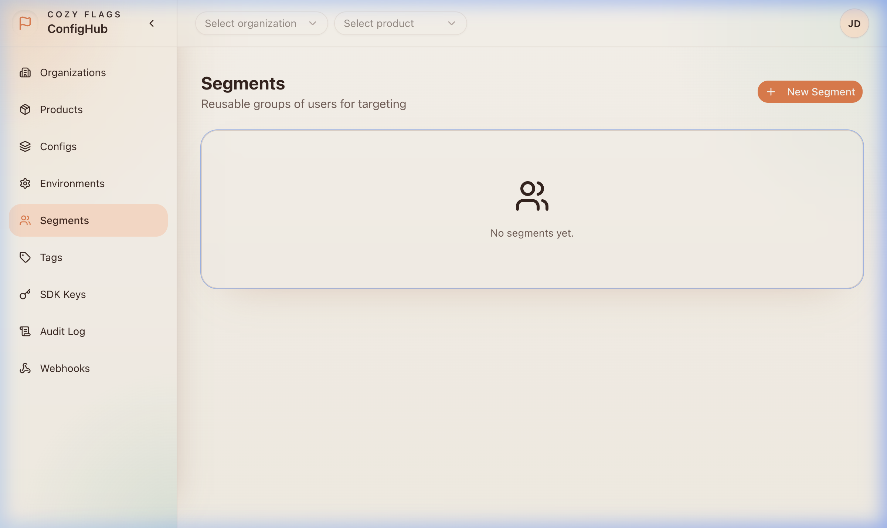

---

## 2. Feature Management

At the heart of Config-Hub are the configurations (feature flags). Here you can define individual flags, control their rollout states, and group them with tags.

### Configs
Manage your individual feature flags and dynamic configurations.
*To create a new one, click the **New Config** button and define its key and settings.*

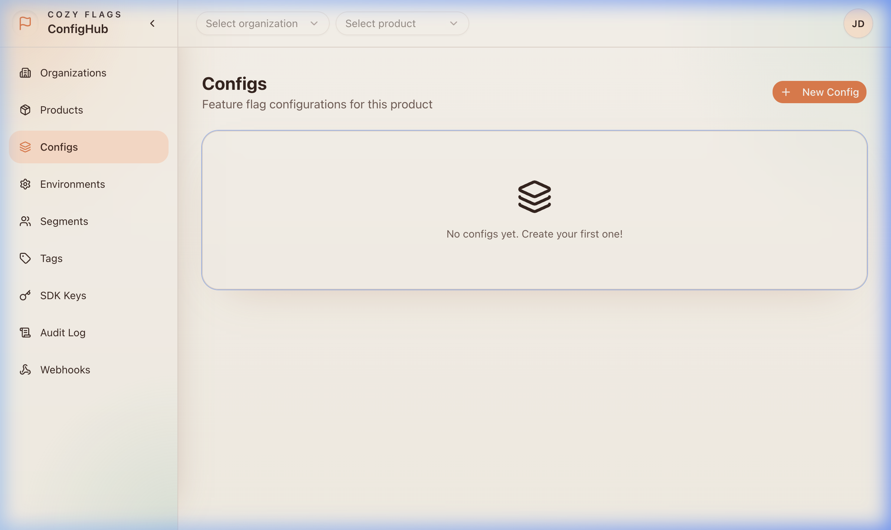
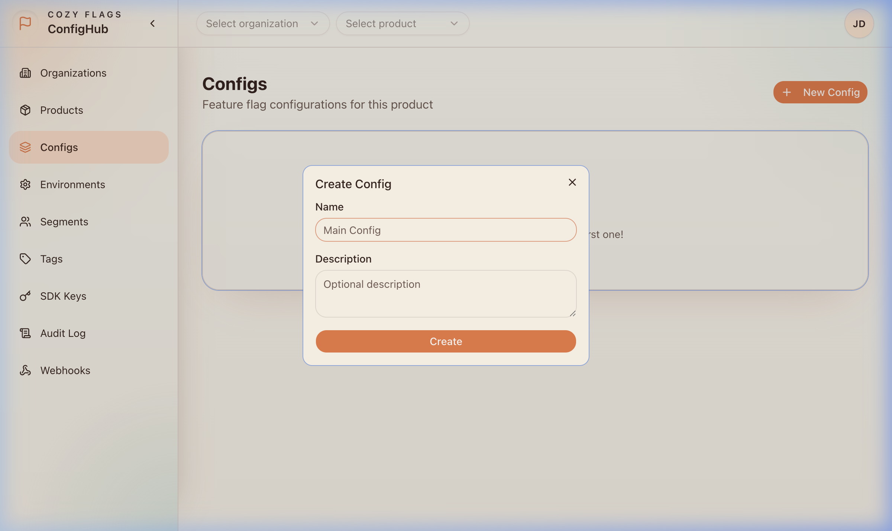

### Environments
Isolate configurations across different deployment stages (e.g., Development, Staging, Production). Each environment has its own independent state for feature flags.

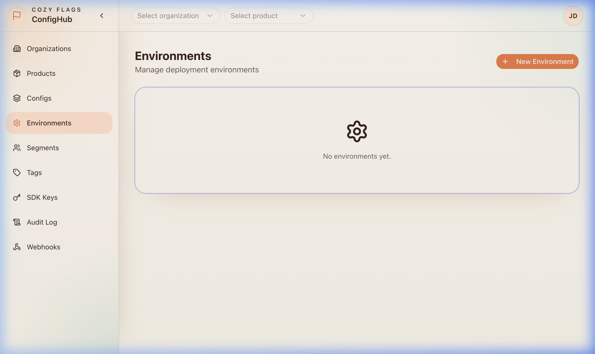
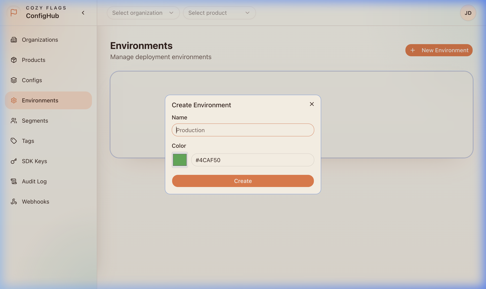

### Segments and Tags
- **Segments:** Target specific groups of users based on custom attributes (e.g., "Beta Users", "Premium Subscribers").
- **Tags:** Categorize and filter your configurations for easier management.

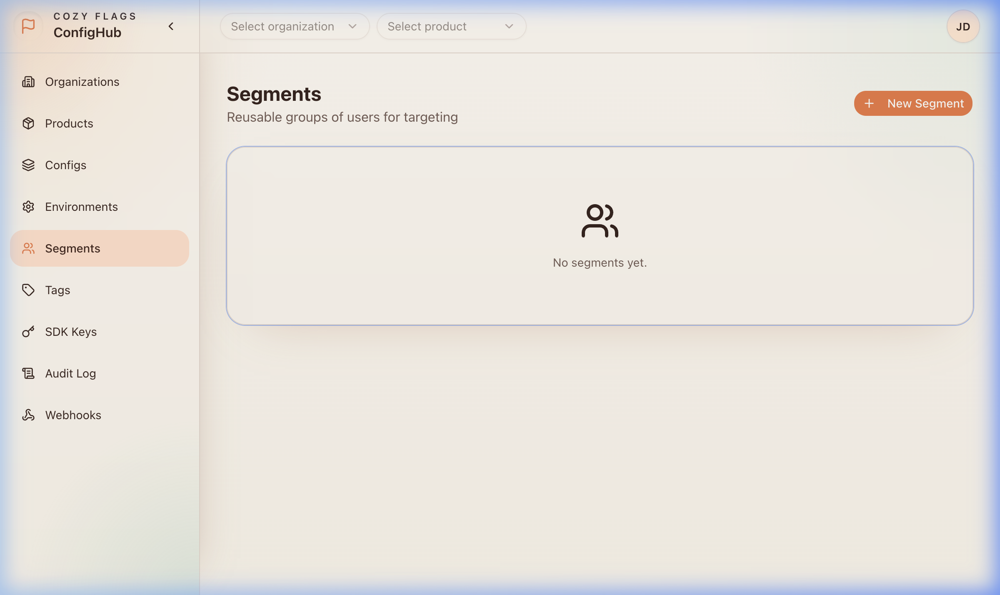
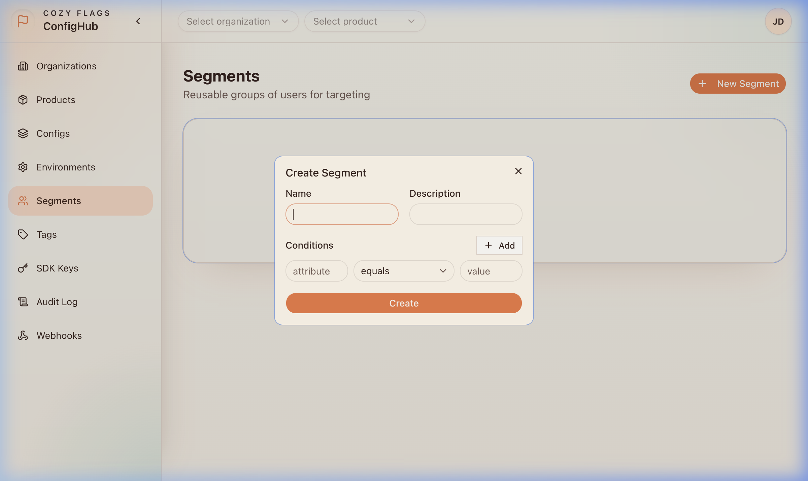
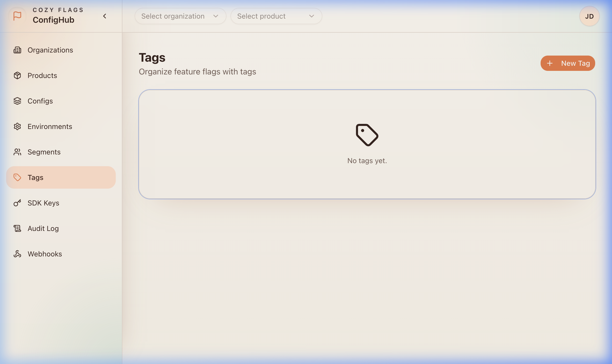

---

## 3. Developer Tools and Integrations

Integrate Config-Hub into your applications and monitor system activity.

### SDK Keys
Generate unique SDK keys for your different environments to securely connect your applications to Config-Hub.

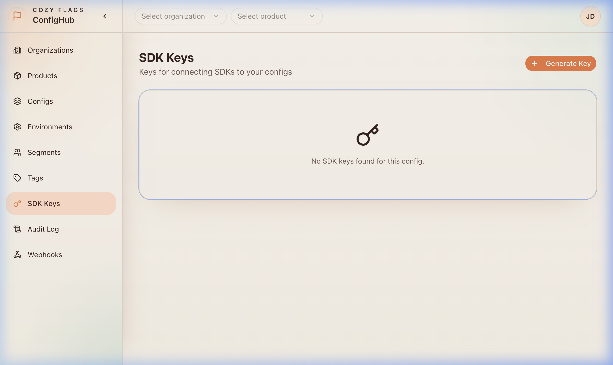

### Audit Logs
Track every change made within your organization. Audit logs provide a comprehensive history of who changed what, and when, ensuring full compliance and traceability.

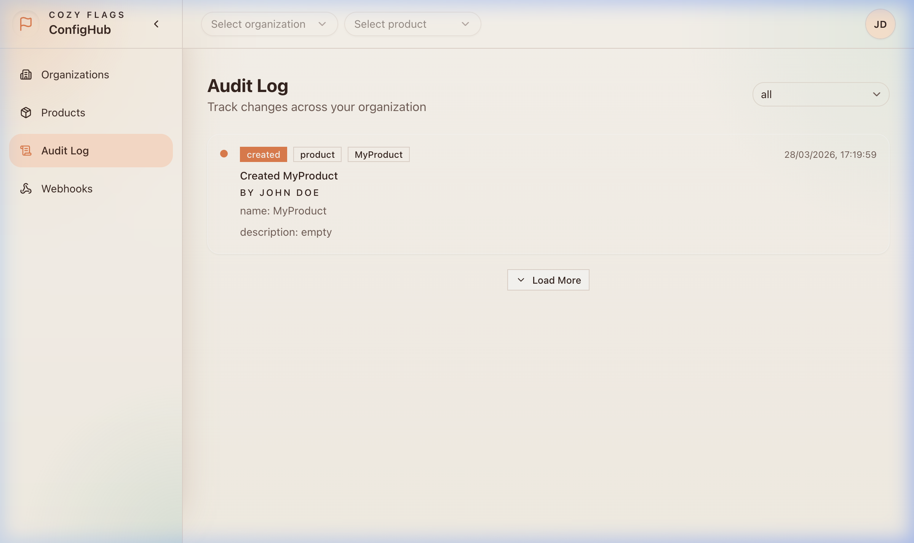

### Webhooks
Set up webhooks to receive real-time notifications about events happening within your Config-Hub environment (e.g., when a feature flag is toggled or updated).

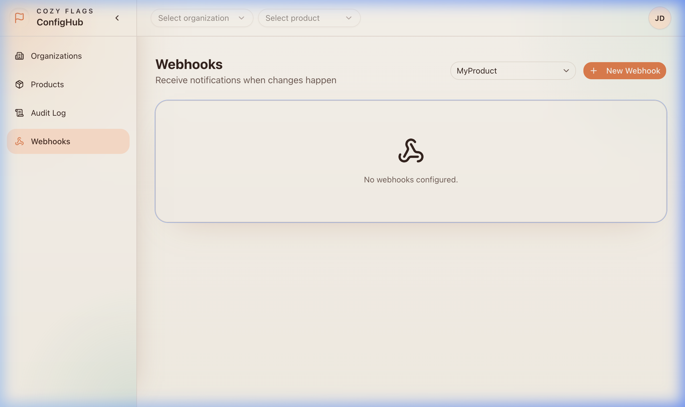

---

## 4. User Profile

Manage your personal settings, password, and session directly from the profile dropdown located at the top right corner.

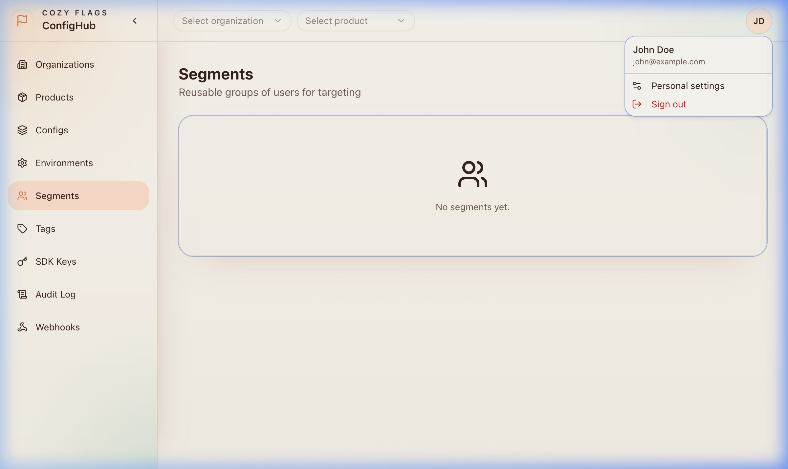

---

## Full Dashboard Walkthrough

> **Note:** Below is a recorded video of the interface exploration covering all these primary features from start to finish.

