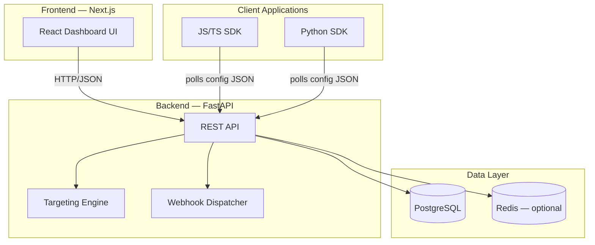
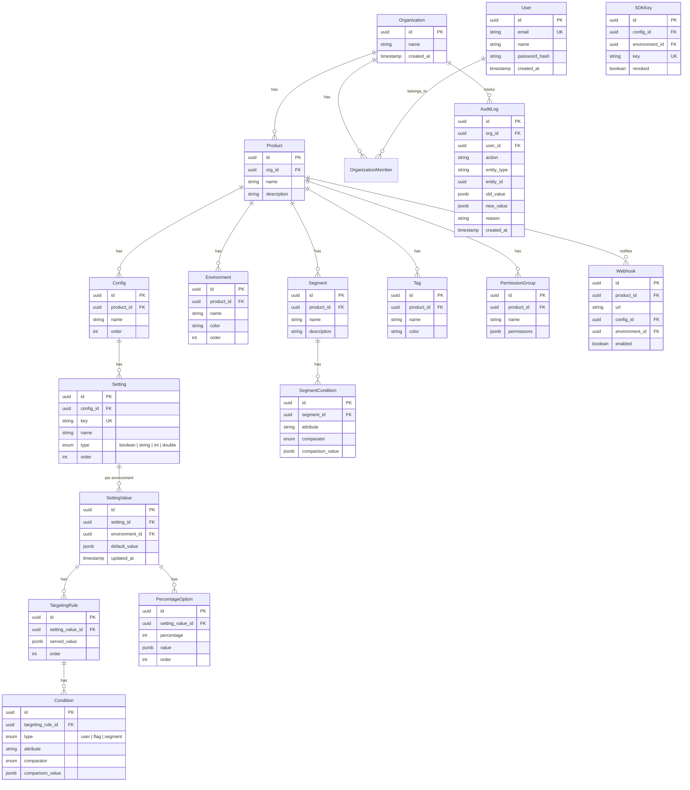

# ConfigCat Replica — Production-Ready Feature Flag Platform

A self-hosted, end-to-end feature flag and remote configuration management platform replicating all core capabilities of ConfigCat.

## Architecture Overview



## Technology Stack

| Layer | Technology | Rationale |
|---|---|---|
| **Backend** | Python 3.12 + FastAPI | Async, high-perf, auto OpenAPI docs |
| **ORM** | SQLAlchemy 2.0 + Alembic | Async ORM, schema migrations |
| **Auth** | JWT (python-jose) + bcrypt | Stateless auth, OAuth-ready |
| **Frontend** | Next.js 14 (App Router) | RSC, file-based routing |
| **UI Components** | shadcn/ui + Tailwind CSS | Accessible, themable, dark mode |
| **Database** | PostgreSQL 16 | Relational model, JSONB for rules |
| **Caching** | Redis (optional) | Config JSON caching for high-throughput |
| **SDK** | Standalone TypeScript package | Client-side evaluation, zero deps |
| **Testing** | pytest + Playwright | Backend unit/integration + E2E browser |

---

## Project Structure

```
inertial-shuttle/
├── backend/                      # FastAPI application
│   ├── app/
│   │   ├── main.py               # FastAPI app factory
│   │   ├── config.py             # Settings (pydantic-settings)
│   │   ├── database.py           # SQLAlchemy async engine/session
│   │   ├── models/               # SQLAlchemy ORM models
│   │   │   ├── organization.py
│   │   │   ├── user.py
│   │   │   ├── product.py
│   │   │   ├── config.py
│   │   │   ├── environment.py
│   │   │   ├── setting.py
│   │   │   ├── targeting.py
│   │   │   ├── segment.py
│   │   │   ├── permission.py
│   │   │   ├── audit_log.py
│   │   │   └── webhook.py
│   │   ├── schemas/              # Pydantic request/response schemas
│   │   ├── routers/              # API route modules
│   │   │   ├── auth.py
│   │   │   ├── organizations.py
│   │   │   ├── products.py
│   │   │   ├── configs.py
│   │   │   ├── environments.py
│   │   │   ├── settings.py
│   │   │   ├── segments.py
│   │   │   ├── permissions.py
│   │   │   ├── audit_log.py
│   │   │   ├── webhooks.py
│   │   │   └── sdk.py            # Public config.json endpoint
│   │   ├── services/             # Business logic layer
│   │   │   ├── evaluator.py      # Targeting engine
│   │   │   ├── config_json.py    # Config JSON generator
│   │   │   ├── audit.py          # Audit log service
│   │   │   └── webhook.py        # Webhook dispatcher
│   │   └── middleware/           # Auth, RBAC, rate limiting
│   ├── alembic/                  # DB migrations
│   ├── tests/
│   ├── requirements.txt
│   └── pyproject.toml
├── frontend/                     # Next.js dashboard
│   ├── src/
│   │   ├── app/                  # App Router pages
│   │   ├── components/           # Shared UI components
│   │   ├── lib/                  # API client, utils
│   │   └── styles/
│   └── package.json
└── packages/
    └── sdk-js/                   # JavaScript/TypeScript SDK
```

---

## Data Model



---

## Proposed Changes

### Phase 1 — Foundation & Core Backend (FastAPI)

#### [NEW] `backend/` — FastAPI application

- **`app/main.py`**: FastAPI app with CORS, exception handlers, router includes
- **`app/config.py`**: Pydantic Settings for DB URL, JWT secret, Redis URL
- **`app/database.py`**: Async SQLAlchemy engine, `AsyncSession` factory
- **`app/models/`**: All SQLAlchemy models matching the ER diagram above
- **`alembic/`**: Migration setup with initial migration for full schema

#### API Surface

| Endpoint Group | Key Routes | Methods |
|---|---|---|
| `/api/v1/auth` | `/register`, `/login`, `/me` | POST, GET |
| `/api/v1/organizations` | CRUD + members | GET, POST, PATCH, DELETE |
| `/api/v1/products` | CRUD under org | GET, POST, PATCH, DELETE |
| `/api/v1/configs` | CRUD under product | GET, POST, PATCH, DELETE |
| `/api/v1/environments` | CRUD under product | GET, POST, PATCH, DELETE |
| `/api/v1/settings` | CRUD under config | GET, POST, PATCH, DELETE |
| `/api/v1/settings/{id}/values/{envId}` | Get/update value + rules | GET, PUT |
| `/api/v1/segments` | CRUD under product | GET, POST, PATCH, DELETE |
| `/api/v1/tags` | CRUD under product | GET, POST, PATCH, DELETE |
| `/api/v1/permissions` | CRUD permission groups | GET, POST, PATCH, DELETE |
| `/api/v1/webhooks` | CRUD under product | GET, POST, PATCH, DELETE |
| `/api/v1/audit-log` | List with filters | GET |
| `/api/v1/sdk/{sdkKey}/config.json` | **Public** — config JSON | GET |

---

### Phase 2 — Targeting Engine

#### [NEW] `backend/app/services/evaluator.py`

Core flag evaluation logic:
- **Comparators**: `EQUALS`, `NOT_EQUALS`, `CONTAINS`, `NOT_CONTAINS`, `STARTS_WITH`, `ENDS_WITH`, `REGEX`, `IS_ONE_OF`, `IS_NOT_ONE_OF`, `SEMVER_LT/GT/EQ`, `NUMBER_LT/GT/EQ`, `BEFORE/AFTER` (datetime), `ARRAY_CONTAINS/NOT_CONTAINS`
- **Rule evaluation**: Iterate top-down, AND within a rule, first match wins
- **Percentage rollout**: SHA256(`settingKey + userId`) → deterministic bucket (0–99)

#### [NEW] `backend/app/services/config_json.py`

Generates config JSON for SDK key:
```jsonc
{
  "settings": {
    "isFeatureEnabled": {
      "type": "boolean",
      "value": false,
      "targetingRules": [
        { "conditions": [...], "value": true }
      ],
      "percentageOptions": [
        { "percentage": 20, "value": true },
        { "percentage": 80, "value": false }
      ]
    }
  },
  "segments": [...]
}
```

---

### Phase 3 — Dashboard UI (Next.js)

#### [NEW] `frontend/` — Next.js 14 application

**Auth pages**: Login, Register, Invite acceptance

**Dashboard pages**:
- Organization & Product management
- Config & Environment management
- Feature flag list with inline toggles, tags, search/filter
- Flag editor: default value, targeting rules builder, percentage rollout, per-environment tabs
- Segment management
- Settings: SDK keys, webhooks, permissions, audit log

**Key components**: `TargetingRuleBuilder`, `PercentageSlider`, `EnvironmentSwitcher`, `FlagToggle`, `AuditTimeline`, `Sidebar`, `TopNav`

**Design**: Dark mode default, glassmorphism cards, Inter font, vibrant accent palette, micro-animations.

---

### Phase 4 — JavaScript SDK

#### [NEW] `packages/sdk-js/`

- `ConfigCatClient.create(sdkKey, { baseUrl, pollInterval })`
- `getValue(key, defaultValue, userObject)` — client-side evaluation
- `getAllValues(userObject)`
- Automatic polling with configurable interval (default 60s)
- In-memory cache, `forceRefresh()`
- Events: `onConfigChanged`, `onFlagEvaluated`
- Zero dependencies, tree-shakeable

---

### Phase 5 — Collaboration & Governance

- **RBAC**: FastAPI dependency injection for permission checks
- **Audit log**: Auto-records all mutations with old/new values
- **Webhooks**: Async HTTP POST on changes, retry with backoff
- **Team invitations**: Token-based email invites

---

### Phase 6 — Integrations & Polish

- Tag-based flag organization
- Cross-environment comparison view
- Rate limiting on SDK endpoint (SlowAPI)
- Error handling, toast notifications
- Responsive mobile dashboard

---

## User Review Required

> [!IMPORTANT]
> **Database**: Plan uses PostgreSQL. Do you have a preference for a different DB, or should I use SQLite for quick local dev with an easy switch to Postgres?

> [!IMPORTANT]
> **Scope**: Recommend implementing **Phases 1–4 first** (FastAPI backend, targeting engine, Next.js dashboard, JS SDK) for a working E2E system, then layering Phases 5–6. Agree?

---

## Verification Plan

### Automated Tests
```bash
# Backend unit/integration tests
cd backend && pytest -v

# E2E browser tests
cd frontend && npx playwright test
```

- **Targeting engine**: All comparators, rule ordering, percentage rollout determinism
- **API routes**: Auth guards, CRUD operations, validation
- **Config JSON**: Snapshot tests for structure correctness

### Manual Verification
1. Start backend (`uvicorn app.main:app --reload`) + frontend (`npm run dev`)
2. Register account → create Organization → Product → Config → Environment
3. Create boolean feature flag, set targeting rules
4. Hit `/api/v1/sdk/{sdkKey}/config.json` — verify JSON
5. Toggle flag, refresh — verify update
6. Check audit log — verify change recorded
